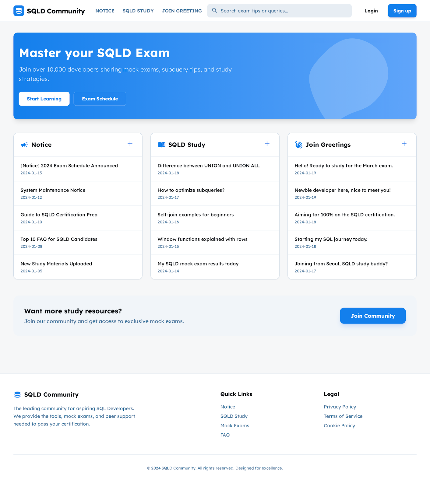

# SQLD Practice Exam Community

This is a web application designed to help users prepare for the SQLD (SQL Developer) certification exam. It provides a platform for users to share study materials, ask questions, and practice with mock exams.

## ✨ Screenshot



## 🚀 Features

- **Community Boards:** Engage with other users through dedicated boards for:
  - **Notices:** Stay updated with the latest exam schedules and announcements.
  - **SQLD Study:** Discuss study topics, share tips, and ask questions.
  - **Join Greetings:** Introduce yourself and connect with fellow learners.
- **Practice Exams:** Access a comprehensive list of practice exam questions.
  - View questions in a clear, sortable table format.
  - Filter exams by session or search for specific topics.
- **Responsive Design:** The application is fully responsive and works seamlessly on both desktop and mobile devices.
- **Light/Dark Mode:** Switch between light and dark themes for a comfortable viewing experience.

## 🛠️ Tech Stack

- **Frontend:** [React](https://react.dev/), [TypeScript](https://www.typescriptlang.org/)
- **Build Tool:** [Vite](https://vitejs.dev/)
- **Styling:** [Tailwind CSS](https://tailwindcss.com/)
- **Routing:** [React Router](https://reactrouter.com/)
- **Animation:** [Framer Motion](https://www.framer.com/motion/)
- **Icons:** [Lucide React](https://lucide.dev/)

## 🏁 Getting Started

To get a local copy up and running, follow these simple steps.

### Prerequisites

- [Node.js](https://nodejs.org/en/) (version 20.x or higher)
- [npm](https://www.npmjs.com/)

### Installation & Running

1. **Clone the repository:**
   ```sh
   git clone https://github.com/MinBokLee/sqld-front.git
   cd sqld-front
   ```

2. **Install dependencies:**
   ```sh
   npm install
   ```

3. **Run the development server:**
   ```sh
   npm run dev
   ```

   The application will be available at `http://localhost:5173`.

## 📂 Project Structure

```
/
├── public/         # Static assets
├── src/
│   ├── assets/       # Image assets
│   ├── components/   # Reusable React components (Header, Footer, Board, etc.)
│   ├── pages/        # Page components (PracticeExams)
│   ├── App.tsx       # Main application component with routing
│   ├── main.tsx      # Application entry point
│   └── index.css     # Global styles
├── package.json
└── README.md
```